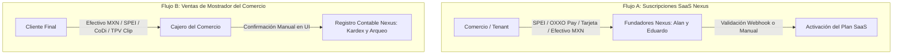

# CONSTITUCIÓN DEL SISTEMA NEXUS
## Gestión Comercial Modular para el Comercio Minorista en México

> **Versión:** 3.0-MX  
> **Última actualización:** Septiembre 2026  
> **Fundadores:** Alan y Eduardo  
> **Propósito:** Este documento define los principios fundamentales, reglas inquebrantables y filosofía de diseño del Sistema Nexus. Cualquier cambio, funcionalidad o decisión técnica debe respetar estos principios.

---

## PREÁMBULO

Nexus nace con una misión clara: **democratizar el acceso a herramientas profesionales de gestión comercial para los pequeños y medianos comercios en México** (tienditas de abarrotes, misceláneas, minisuper, tiendas de conveniencia y comercios independientes), operando en un contexto de recursos limitados, sector informal/RESICO y necesidad de adopción digital ágil y sin fricciones.

Esta constitución es el documento "sagrado" del proyecto. Cuando haya duda sobre si una funcionalidad debe implementarse o no, se consulta este documento. Cuando alguien (un fundador, un futuro empleado, o una IA) proponga un cambio, debe justificarlo frente a estos principios.

---

## ARTÍCULO I: PROPÓSITO Y FILOSOFÍA

### 1.1 Misión del Sistema
Nexus es un **Sistema de Gestión Comercial Modular** diseñado específicamente para el mercado retail minorista en México, operando bajo un modelo **SaaS Multi-tenant**. Su propósito es ayudar al comerciante a:
- Controlar su inventario de forma precisa en tiempo real
- Vender más rápido, reduciendo filas y errores en caja
- Tomar decisiones comerciales basadas en datos reales y rentabilidad
- Digitalizar su negocio y conectar con sus clientes vía WhatsApp sin fricciones técnicas

### 1.2 Principios Fundamentales (Inquebrantables)

1. **Simplicidad sobre Complejidad:** Cada funcionalidad debe resolver un problema real del comerciante minorista mexicano. No se implementa tecnología por moda ni se sobrecarga la experiencia del usuario.
2. **Consistencia ACID sobre Velocidad:** En operaciones críticas (ventas, inventario, kardex), la consistencia de datos es innegociable. Preferimos un sistema riguroso y correcto a uno rápido pero inconsistente.
3. **Multi-tenant desde el Día 1:** Cada línea de código debe asumir que hay múltiples comercios compartiendo la misma infraestructura. El aislamiento de datos mediante Row-Level Security (RLS) es sagrado.
4. **Moneda Base Nativa MXN:** El Peso Mexicano (MXN) es el ciudadano de primera clase en todo el sistema. Costos, precios, arqueos y reportes operan nativamente en MXN. El Dólar Estadounidense (USD) se contempla como moneda secundaria opcional configurada únicamente para mercancía importada o comercios en la franja fronteriza norte.
5. **Mobile-First:** Diseñamos primero para smartphone (Android), porque es el dispositivo principal de la mayoría de los pequeños comerciantes. La versión PC/Web (Flutter Web) es complementaria.
6. **Bootstrap (Crecimiento con Recursos Limitados):** Empezamos con lo mínimo viable, validamos el producto en campo con comercios reales y crecemos reinvirtiendo las ganancias.
7. **El Sistema NO es una Pasarela de Pagos en Punto de Venta:** Nexus actúa como un registro contable de las ventas y cobros del comercio; no procesa, no retiene ni valida automáticamente los fondos recibidos en mostrador.
8. **Rapidez y Eficiencia para el Usuario:** El cajero y el dueño deben ahorrar tiempo y eliminar tareas manuales repetitivas. Esta es nuestra ventaja competitiva principal.
9. **Cero Fricción en Setup e Inventario Orgánico (Just-in-Time):** Ningún comerciante debe ser forzado a inventariar todo su negocio antes de empezar a vender. El sistema debe permitir operar desde el minuto 1 y construir el catálogo de forma progresiva, asistida y sin sobrecostos en servidores.

---

## ARTÍCULO II: ARQUITECTURA TÉCNICA INQUEBRANTABLE

### 2.1 Stack Tecnológico Obligatorio

| Capa | Tecnología | Justificación |
|------|-----------|---------------|
| **Backend/API** | Python + FastAPI | Alto rendimiento, asincronismo nativo, OpenAPI automático |
| **Frontend** | Flutter (Dart) | Código único multiplataforma para Android, iOS y Web |
| **Base de Datos** | PostgreSQL | RLS nativo, consistencia ACID, extensión `pg_trgm` para búsqueda fuzzy |
| **Manejo de Estado** | Riverpod | Inmutabilidad, testabilidad y arquitectura reactiva moderna |
| **Caché Local** | Hive / SharedPreferences | Solo lectura persistente, sin sincronización bidireccional compleja |
| **Escáner de Código de Barras** | mobile_scanner (Flutter) | Uso de la cámara del celular, rápido, open-source |
| **OCR y Visión On-Device** | Google ML Kit Text Recognition | Procesamiento 100% offline en el smartphone, sin costo de API en la nube |

### 2.2 Arquitectura Multi-tenant

- **Modelo:** Base de datos compartida (*Single Database*) con columna `tenant_id` en todas las tablas del negocio.
- **Seguridad:** Row-Level Security (RLS) de PostgreSQL obligatorio y estricto.
- **Contexto:** Cada petición autenticada ejecuta `SET app.current_tenant = 'uuid'` antes de cualquier consulta.
- **Índices:** Todos los índices relacionales incluyen `tenant_id` como primera columna.
- **Escala objetivo inicial:** Hasta 100 comercios activos en Fase 1.

### 2.3 Manejo de Moneda Nativa MXN y Precios Históricos

**Regla de Oro Contable:**
- Los productos registran `cost_mxn` y `price_mxn` como valores base obligatorios.
- Opcionalmente, se habilita `cost_usd_import` para artículos adquiridos en el extranjero.
- El flujo estándar de venta opera 100% en Pesos Mexicanos (MXN) sin dependencia de APIs externas de tasas de cambio, garantizando máxima velocidad en el checkout.
- La tabla `sale_items` almacena `unit_cost_mxn` congelado en el instante exacto de la venta.
- En comercios fronterizos donde se habilite visualización bimoneda, el sistema consulta la tasa oficial de Banxico y congela `usd_mxn_exchange_rate_applied`.
- Los reportes de rentabilidad histórica utilizan estos valores congelados, garantizando una auditoría contable exacta.

### 2.4 Conectividad y Sincronización

- **Arquitectura de Escritura:** Exclusivamente Online (garantía de stock unificado sin colisiones).
- **Modo Caché Local:** Solo lectura. Si el comercio pierde conexión a internet, puede consultar productos y precios, pero la creación de ventas queda pausada.
- **Interceptor de Red:** La interfaz notifica al usuario si la conexión falla durante una operación de escritura y solicita reconexión.
- **Justificación:** La rotura de stock y la sobreventa física en tienda son problemas graves. Es preferible que el cajero reconecte su red a vender artículos agotados.

### 2.5 Escaneo de Código de Barras y Góndola

- **Método principal:** Cámara del smartphone mediante `mobile_scanner`.
- **Método alternativo:** Lectores ópticos externos USB/Bluetooth (emulación de teclado HID para PC/Tablet).
- **Modo Escaneo Continuo de Góndola (Batch):** Permite mantener la cámara activa en ráfaga para registrar existencias y precios en anaqueles en cuestión de segundos.
- **Formatos soportados:** EAN-13, UPC-A, Code 128, QR, DataMatrix.
- **Rendimiento objetivo:** Reconocimiento y agregado al carrito en menos de 1 segundo.

---

## ARTÍCULO III: SEPARACIÓN DE RESPONSABILIDADES FINANCIERAS

### 3.1 Principio Fundamental

> **El Sistema NO es una Pasarela de Pagos para las ventas del comercio minorista.**

### 3.2 Dos Flujos Financieros Completamente Separados

#### A) Cobro de Suscripciones SaaS (Nexus → Tenant)
- **Propósito:** Los fundadores cobran la cuota mensual a los comercios por el uso de la plataforma.
- **Canales de cobro en México:**
  - **SPEI (STP / Transferencia Interbancaria con CLABE dedicada):** Conciliación automática 24/7.
  - **OXXO Pay:** Pago en efectivo en más de 20,000 sucursales OXXO mediante código de barras / referencia de 14 dígitos.
  - **Mercado Pago / Stripe:** Cobro con tarjetas de débito/crédito mexicanas.
  - **Efectivo MXN:** Cobro presencial manual durante visitas de activación inicial.
- **Idempotencia:** Tablas de control para asegurar que ningún webhook procese dos veces la misma acreditación.

#### B) Registro de Ventas del Comercio (Tenant → Cliente Final)
- **Propósito:** El comerciante cobra a sus clientes por mercancía y abarrotes.
- **Métodos en punto de venta:** Efectivo MXN, Transferencia SPEI, CoDi / Dimo (Banxico), Terminales TPV (Clip, Mercado Pago Point, Zettle).
- **Validación:** **Manual por el cajero.** El cajero verifica físicamente el efectivo o el comprobante bancario del cliente.
- **Rol del Sistema:** Registro contable estricto para control de caja, arqueos y reportes de rentabilidad.

---

## ARTÍCULO IV: RESTRICCIONES PRESUPUESTARIAS (BOOTSTRAP)

### 4.1 Límites Financieros Iniciales

- **Presupuesto máximo de hosting:** ~$10 a $30 USD/mes (~$200 a $600 MXN/mes) en Fase 1.
- **Prioridad:** Soluciones open-source, tiers gratuitos confiables y VPS de costo predecible.
- **Backups:** Automatización con scripts propios y almacenamiento en la nube sin costo inicial.
- **Soporte:** Atendido directamente por los fundadores (Alan y Eduardo) para retroalimentación directa de producto.

### 4.2 Decisiones de Arquitectura Limitadas por Presupuesto

- ❌ **NO contratar servicios de IA/LLM de pago** (OpenAI, Claude) en los flujos transaccionales del MVP.
- ❌ **NO contratar APIs cloud de visión/OCR de pago por petición** (AWS Textract, Google Cloud Vision); se utilizan motores On-Device locales (`google_mlkit_text_recognition`).
- ❌ **NO contratar infraestructura hyperscaler de alto costo** (AWS, Google Cloud) hasta alcanzar la Fase 3.
- ❌ **NO implementar servidores físicos dedicados** en fases tempranas.
- ✅ **USAR VPS económicos** (Contabo, Hetzner, ~$10 USD/mes).
- ✅ **USAR almacenamiento de objetos gratuito** (Cloudflare R2, Backblaze B2).
- ✅ **OPTIMIZAR código y base de datos** para correr eficientemente con recursos moderados (2-4GB RAM).

---

## ARTÍCULO V: MÉTODOS DE COBRO DE SUSCRIPCIONES SAAS

### 5.1 Realidad del Mercado Retail Mexicano

- La adopción de transferencias SPEI vía banca móvil y pagos en efectivo vía OXXO Pay cubren más del 90% del mercado comercial en México.
- El sistema debe soportar tanto validación automática por webhooks como confirmación manual asistida por los fundadores.

### 5.2 Matriz de Medios de Pago SaaS Aceptados

| Método | Automatización | Proceso de Validación |
|--------|----------------|----------------------|
| **SPEI (STP / CLABE)** | ✅ Automática | Webhook concilia el pago al instante y activa la cuenta |
| **OXXO Pay** | ✅ Automática | Webhook notifica el pago en tienda y renueva la suscripción |
| **Mercado Pago / Tarjeta** | ✅ Automática | Cargo recurrente / único con confirmación en tiempo real |
| **SPEI Manual (Captura)** | ⚠️ Manual | El tenant sube comprobante → Fundadores validan en banco → Activan |
| **Efectivo MXN** | ❌ Manual | Fundadores reciben efectivo en campo → Activan en panel admin |

### 5.3 Panel de Administración Interno (Para Fundadores)

- Panel exclusivo para Alan y Eduardo para monitorear el estado del SaaS.
- Bandeja de pagos pendientes de conciliación manual.
- Interfaz para aprobar, extender periodos de prueba o reactivar comercios.
- Dashboard de métricas financieras clave: MRR en Pesos Mexicanos ($ MXN), churn y nuevos registros.

---

## ARTÍCULO VI: MODELO COMERCIAL (SAAS)

### 6.1 Estructura de Planes en Pesos Mexicanos (MXN)

| Plan | Tarifa Mensual | Módulos Incluidos | Límite Usuarios | Características Destacadas |
|------|----------------|-------------------|-----------------|----------------------------|
| **Emprendedor** | **$199 MXN / mes** | Inventario, Ventas, Compras base | Hasta 2 | 1 Almacén, Alertas de stock bajo, Notas de venta en ticket/PDF, Reportes básicos |
| **Comercio** | **$399 MXN / mes** | Todo el plan Emprendedor + Caja y Tesorería | Hasta 5 | Multi-almacén, Arqueo con cono Banxico, Catálogo WhatsApp con pedidos, Pagos mixtos |
| **Corporativo** | **$699 MXN / mes** | Todos los módulos del sistema | Hasta 15 | Analítica avanzada, KPIs de rentabilidad comparativa, permisos multi-sucursal |

### 6.2 Punto de Equilibrio Financiero

- **Con 3 clientes en Plan Emprendedor:** ~$600 MXN / mes cubren la infraestructura básica del VPS.
- **Con 2 clientes en Plan Comercio:** ~$800 MXN / mes generan balance positivo inicial.
- **Con 5 clientes combinados:** Se alcanza sustentabilidad operativa total del proyecto en Fase 1.

### 6.3 Ciclo de Vida y Máquina de Estados de Suscripción

1. **ACTIVE:** Acceso completo a las funcionalidades según el plan contratado.
2. **SOFT_LOCK (Días 1-10 de morosidad):** Modo de solo lectura; permite consultar inventario y reportes históricos, pero **bloquea la creación de nuevas ventas y compras**.
3. **HARD_LOCK (Día 11+ de morosidad):** Bloqueo total de la interfaz. Muestra únicamente la pantalla de reactivación y canales de pago.

---

## ARTÍCULO VII: REGLAS DE NEGOCIO SAGRADAS

### 7.1 Inventario y Control de Stock

- **Multi-almacén Estructurado:** La entidad `warehouses` existe siempre en el modelo. Los planes base incluyen un "Almacén Principal" por defecto.
- **Stock Reservado con TTL (Time-To-Live):** El stock de una venta en estado `PENDING_PAYMENT` se reserva por un máximo de **15 minutos**. Un Cron Job libera automáticamente los artículos si la transacción no se finaliza.
- **Kardex Obligatorio:** Todo movimiento físico de stock (entrada, salida, ajuste, merma, traslado) debe persistirse en `inventory_movements` con motivo y referencia documental.

### 7.2 Ventas, Caja y Denominaciones de Banxico

- **Máquina de Estados de Venta:** Transición estricta: `DRAFT` $\rightarrow$ `PENDING_PAYMENT` $\rightarrow$ `PAID` $\rightarrow$ `COMPLETED` / `CANCELLED` / `REFUNDED`.
- **Arqueo de Caja con Cono Monetario Oficial de Banxico:**
  - **Billetes:** $1,000, $500, $200, $100, $50, $20 MXN.
  - **Monedas:** $20, $10, $5, $2, $1, $0.50 MXN.
  - La tabla `cash_session_denominations` almacena el conteo físico exacto de cada denominación para auditoría de descuadres.
- **Calculadora de Vuelto en Efectivo:** Interfaz de punto de venta optimizada con atajos para billetes comunes mexicanos ($50, $100, $200, $500 MXN) y cálculo instantáneo del cambio.

### 7.3 Registro Minimalista de 3 Campos y Lazy Loading en Punto de Venta

- **Objetivo:** Permitir al cajero registrar un artículo no catalogado en **menos de 5 segundos** sin detener la venta.
- **Formulario Minimalista de 3 Campos Vitales:** Únicamente **Nombre**, **Precio de Venta ($ MXN)** y **Cantidad/Stock inicial**.
- **Metadatos Secundarios Automatizados:** El sistema autogenera el SKU (`NEX-XXXXX`), asigna la categoría por defecto ("General") y permite completar detalles adicionales de forma diferida.
- **Inventario Orgánico Just-in-Time:** Si se escanea un producto no existente durante el checkout, se cobra y se guarda silenciosamente en la base de datos maestra para ventas futuras.

### 7.4 Catálogo Digital WhatsApp

- **Formato:** Página web pública responsiva (`nexus.com/tienda/nombre-comercio`).
- **Funcionalidad:** Los clientes arman su carrito y el sistema genera un pedido estructurado para enviar al WhatsApp del comercio.
- **Precios:** Sincronizados en tiempo real en Pesos Mexicanos ($ MXN).

### 7.5 Motor Híbrido de Catálogo Semilla y Red Comunitaria (Two-Tier Engine)

- **Tier 1 (Catálogo Semilla Maestro EAN-13 Oficial):** Base de datos precargada y offline con los ~1,000 a 2,000 productos líderes de abarrotes en México (GS1 EAN-13). Al escanear el código, autocompleta nombre y categoría en < 1 ms.
- **Tier 2 (Red Comunitaria Crowdsourced con Consenso Automático):** 
  - Cuando un producto no existe en Tier 1, el comercio ingresa su nombre y se envía un registro descriptivo anónimo a la tabla global de sugerencias.
  - **Regla de Consenso:** Requiere que al menos **3 comercios independientes distintos** registren el mismo EAN con similitud > 80% (`pg_trgm`) para promoverse automáticamente a sugerencia verificada de la red.
  - **Aislamiento y Privacidad Sagrada:** **NUNCA** se comparten costos, precios, existencias ni la identidad de los comercios. Cero moderación manual requerida por los fundadores.

### 7.6 Gamificación del Onboarding y Setup Asistido

- Barra de progreso visual con hitos claros (ej. *"¡Has registrado tus primeros 50 artículos!"*).
- Recompensas tangibles automáticas por completar la configuración inicial en la primera semana (ej. 1 mes gratis adicional de suscripción o desbloqueo temporal de módulos premium).

### 7.7 OCR On-Device y Dictado de Voz Nativo

- **OCR On-Device:** Extracción de datos de facturas físicas mediante **Google ML Kit Text Recognition** directamente en el procesador del smartphone (offline, costo $0 de servidor).
- **Dictado de Voz Nativo:** Uso del motor local de reconocimiento de voz del sistema operativo (Android Speech / Web Speech API) para dictar productos y cantidades sin consumir APIs externas de pago.

### 7.8 Escaneo Continuo y Clonación entre Sucursales

- **Modo Escaneo de Góndola:** Modo ráfaga continuo que detecta códigos de barras sucesivamente, pidiendo únicamente cantidad y precio en teclado numérico gigante.
- **Clonación de Catálogo:** Mecanismo en 1 clic para duplicar la estructura del catálogo maestro hacia nuevas sucursales o comercios aliados (con stock en 0).

---

## ARTÍCULO VIII: CONVENCIONES DE CÓDIGO Y PROHIBICIONES

### 8.1 Nomenclatura Estándar

- **Tablas:** Snake_case, plural (ej: `products`, `sale_items`, `cash_session_denominations`, `community_verified_catalog`).
- **Columnas:** Snake_case (ej: `tenant_id`, `price_mxn`, `created_at`).
- **Enums:** UPPER_SNAKE_CASE (ej: `CASH_MXN`, `SPEI`, `ACTIVE`).
- **Endpoints API:** Kebab-case (ej: `/api/v1/cash/close-session`).
- **Modelos/Clases:** PascalCase.

### 8.2 Lo que el Sistema NO Debe Hacer (Prohibiciones Inquebrantables)

- ❌ **No implementar timbrado fiscal digital CFDI 4.0 / SAT ni integración con PACs en esta fase:** El sistema emite notas de venta y recibos de control administrativo interno.
- ❌ **No usar APIs cloud de visión/OCR o LLMs de pago por petición:** Se utiliza procesamiento On-Device local (`google_mlkit_text_recognition`) con costo $0 de infraestructura.
- ❌ **No validar automáticamente fondos en ventas de mostrador:** El sistema actúa como registro contable; no procesa pagos de clientes en tienda.
- ❌ **No mezclar pasarelas SaaS con cobros de mostrador:** OXXO Pay y SPEI automatizado son para cobrar la suscripción de Nexus, no para las ventas de la tiendita.
- ❌ **No exigir catálogos manuales ni moderación humana a los fundadores:** La base comunitaria opera exclusivamente por consenso algorítmico autónomo de 3 comercios.
- ❌ **No implementar sincronización bidireccional offline compleja:** Se mantiene arquitectura online con caché local de solo lectura.
- ❌ **No almacenar contraseñas en texto plano:** Usar siempre hashing seguro con `bcrypt` o `argon2`.
- ❌ **No exponer IDs internos secuenciales:** Utilizar siempre UUIDs públicos en APIs y URLs.

### 8.3 Decisiones Diferidas a Fases Posteriores

- ⏳ Integración con timbrado fiscal digital CFDI 4.0 ante el SAT y PACs autorizados (Fase 3+).
- ⏳ Integración directa con SDK de terminales de cobro (Clip / Mercado Pago Point).
- ⏳ Impresión térmica ESC/POS vía Bluetooth/USB directa desde Flutter Web/Mobile.
- ⏳ Modelos de IA/Machine Learning para pronóstico de demanda.

---

## ANEXO A: GLOSARIO DE TÉRMINOS (MÉXICO)

- **Tenant:** Comercio minorista registrado en el SaaS (tiendita de abarrotes, miscelánea, etc.).
- **MXN:** Peso Mexicano, moneda de curso legal y base de cálculo del sistema.
- **Banxico:** Banco de México, banco central emisor de la moneda y regulador financiero.
- **SPEI:** Sistema de Pagos Electrónicos Interbancarios de Banxico para transferencias inmediatas.
- **CoDi / Dimo:** Plataformas de cobro digital inmediato de Banxico vía código QR o número telefónico.
- **OXXO Pay:** Solución de pago de comercio electrónico para abonar en tiendas de conveniencia OXXO.
- **EAN-13:** Estándar internacional de código de barras de 13 dígitos administrado por GS1 México.
- **Nota de Venta:** Comprobante comercial interno no timbrado ante el SAT, estándar en microcomercios y RESICO.
- **Arqueo de Caja:** Verificación y cuadre físico de dinero en efectivo versus ventas registradas en el sistema.
- **Lazy Loading POS:** Registro dinámico y automático de productos no catalogados durante el flujo de venta.

---

## ANEXO B: CHECKLIST PARA NUEVAS FUNCIONALIDADES

Antes de codificar cualquier nueva funcionalidad, verificar:
- [ ] ¿Respeta los principios rectores del Artículo I (incluyendo Cero Fricción en Setup)?
- [ ] ¿Está modelada en Pesos Mexicanos (MXN) como moneda nativa base?
- [ ] ¿Cumple con el aislamiento multi-tenant RLS en PostgreSQL?
- [ ] ¿Evita dependencias o integraciones con el SAT / CFDI 4.0 en esta fase?
- [ ] ¿Es compatible con el cono monetario oficial de Banxico si involucra caja?
- [ ] ¿Utiliza procesamiento On-Device sin costo de APIs cloud de visión/IA?
- [ ] ¿Respeta el modelo de 3 campos vitales y autocompletado con catálogo EAN?
- [ ] ¿Está diseñada bajo el enfoque Mobile-First para smartphone Android?
- [ ] ¿Aporta rapidez y ahorra tiempo al comerciante?
