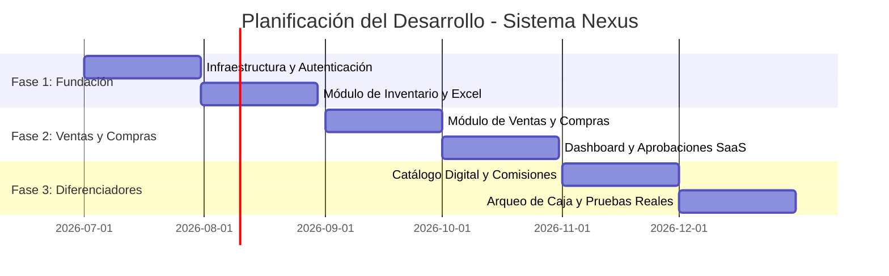

# DOCUMENTO MAESTRO DEL SISTEMA NEXUS v3.0
## Gestión Comercial Modular - Minorista Venezuela

> **Versión:** 3.0  
> **Última actualización:** Julio 2026  
> **Estado:** Especificación Técnica Aprobada (SDD)  
> **Fundadores:** Alan y Eduardo  

---

## 📋 TABLA DE CONTENIDOS

1. [Introducción y Contexto](#1-introducción-y-contexto)
2. [Arquitectura Técnica](#2-arquitectura-técnica)
3. [Planes de Suscripción (SaaS)](#3-planes-de-suscripción-saas)
4. [Separación de Responsabilidades Financieras](#4-separación-de-responsabilidades-financieras)
5. [Módulos Funcionales](#5-módulos-funcionales)
6. [Sub-Requisitos UX](#6-sub-requisitos-ux)
7. [Esquema de Base de Datos](#7-esquema-de-base-de-datos)
8. [Hosting e Infraestructura](#8-hosting-e-infraestructura)
9. [Seguridad y Roles](#9-seguridad-y-roles)
10. [Timeline de Desarrollo](#10-timeline-de-desarrollo)
11. [Convenciones de Código](#11-convenciones-de-código)

---

## 1. INTRODUCCIÓN Y CONTEXTO

### 1.1 Misión y Principios
El sistema se rige en su totalidad por la misión y los principios fundamentales e inquebrantables detallados en el [Artículo I de la Constitución de Nexus](file:///d:/aland/Documents/Proyectos/Nexus/Constitucion%20Nexus%20v1-0.md#articulo-i-proposito-y-filosofia).

### 1.2 Mercado Objetivo y Alcance
* **Segmento:** Comercios informales en Venezuela (bodegas, minimarkets, tiendas de ropa, farmacias pequeñas).
* **Dispositivo principal:** Teléfonos celulares Android (gama baja/media) mediante aplicación móvil Flutter.
* **Dispositivo secundario:** PC/Tablet a través de Flutter Web.
* **Alcance Fiscal:** Comprobantes administrativos internos. No se requiere facturación fiscal SENIAT (ver [Sección 8.5 de la Constitución](file:///d:/aland/Documents/Proyectos/Nexus/Constitucion%20Nexus%20v1-0.md#85-lo-que-el-sistema-no-debe-hacer-nunca)).

---

## 2. ARQUITECTURA TÉCNICA

### 2.1 Stack Tecnológico
El stack tecnológico y sus justificaciones cumplen con la ley de stack del [Artículo II (Sección 2.1) de la Constitución de Nexus](file:///d:/aland/Documents/Proyectos/Nexus/Constitucion%20Nexus%20v1-0.md#21-stack-tecnologico-obligatorio). 

Librerías y herramientas adicionales para la implementación de las especificaciones:
* **Búsqueda Fuzzy:** PostgreSQL utilizando la extensión `pg_trgm`.
* **Caché Local Frontend:** `Hive` / `SharedPreferences` para almacenamiento persistente ligero de solo lectura.
* **Escaneo de Código de Barras:** `mobile_scanner` en Flutter para procesamiento ágil de imágenes capturadas con la cámara.

### 2.2 Arquitectura Multi-tenant
El aislamiento de inquilinos y la seguridad de datos se implementan mediante políticas RLS y contextos dinámicos detallados en el [Artículo II (Sección 2.2) de la Constitución](file:///d:/aland/Documents/Proyectos/Nexus/Constitucion%20Nexus%20v1-0.md#22-arquitectura-multi-tenant).

### 2.3 Manejo Bimoneda y Tasa Histórica
Los flujos de costos base, precios y congelación de tasas en ventas se modelan según las directrices contables del [Artículo II (Sección 2.3) de la Constitución](file:///d:/aland/Documents/Proyectos/Nexus/Constitucion%20Nexus%20v1-0.md#23-manejo-bimoneda-y-tasa-historica).

### 2.4 Conectividad, Sincronización y Escaneo
La lógica de red de solo lectura local y la interacción con códigos de barras se definen bajo las directrices del [Artículo II (Sección 2.4 y 2.5) de la Constitución](file:///d:/aland/Documents/Proyectos/Nexus/Constitucion%20Nexus%20v1-0.md#24-conectividad-y-sincronizacion).

### 2.5 Registro de Productos al Vuelo (Sin IA)
* **Algoritmo de Búsqueda:** Utiliza similitud de trigramas (Levenshtein) a nivel de base de datos (`pg_trgm`) para ofrecer autocompletado en tiempo real al cajero al escanear un código no registrado.
* **Campos Obligatorios:** Nombre del producto, Precio (USD), Stock inicial.
* **Interfaz UX:** Modal emergente no bloqueante que permite continuar el flujo de venta y guardar el producto en background.

---

## 3. PLANES DE SUSCRIPCIÓN (SAAS)

La estructura de precios, cálculos de punto de equilibrio y la máquina de estados de suscripciones (`ACTIVE` $\rightarrow$ `SOFT_LOCK` $\rightarrow$ `HARD_LOCK`) se rigen por el [Artículo VI de la Constitución de Nexus](file:///d:/aland/Documents/Proyectos/Nexus/Constitucion%20Nexus%20v1-0.md#articulo-vi-modelo-comercial-saas). 

El acceso a los módulos y límites se controla dinámicamente en middleware validando el `PlanID` asignado a cada `tenant_id`.

---

## 4. SEPARACIÓN DE RESPONSABILIDADES FINANCIERAS

El sistema opera bajo la estricta división entre cobros de SaaS y registro contable de ventas de comercios definida en el [Artículo III de la Constitución](file:///d:/aland/Documents/Proyectos/Nexus/Constitucion%20Nexus%20v1-0.md#articulo-iii-separacion-de-responsabilidades-financieras).

### 4.1 Panel de Administración Interno (Para Fundadores)
Interfaz exclusiva para Alan y Eduardo para la gestión manual del SaaS:
* **Validación Manual:** Módulo de aprobación/rechazo de Pago Móvil, Zinli y Efectivo, verificando capturas de pantalla de los tenants contra estados bancarios físicos.
* **Notificaciones:** Activación automática del estado `ACTIVE` del tenant tras aprobar el pago y envío de emails transaccionales de confirmación.
* **Métricas:** Dashboard administrativo con ingresos mensuales acumulados (MRR), total de tenants activos e historial de pagos validados.

---

## 5. MÓDULOS FUNCIONALES

### 5.1 Módulo de Inventario y Abastecimiento (Core)

| ID | Requisito | Descripción |
|----|-----------|-------------|
| **RF-01** | Carga Inicial Masiva | Script automatizado para extraer, limpiar y normalizar datos desde Excel hacia PostgreSQL. |
| **RF-02** | Manejo Bimoneda Nativo | Registro de costos y precios en USD. Cálculo automático en VES usando tasa del día, con opción de precio manual en VES. |
| **RF-03** | Combos y Promociones | Agrupación de productos con precio único. Al venderse, descuenta proporcionalmente el stock de cada artículo individual. |
| **RF-04** | Alertas de Stock Bajo | Notificaciones automáticas cuando un producto está por agotarse (basado en umbrales configurables, sin IA). |
| **RF-05** | Reportes de Inventario | Exportación a PDF/Excel del estado actual, filtrable por categoría, stock, almacén, alfabético, etc. |
| **RF-06** | Gestión de Stock Reservado | El stock reservado en venta no cobrada expira automáticamente en 15 minutos (cron job). |
| **RF-07** | Multi-almacén (Plan Comercio+) | Crear, gestionar y transferir stock entre almacenes. El Plan Emprendedor tiene 1 almacén por defecto. |

### 5.2 Módulo de Ventas y Comisiones (Core)

| ID | Requisito | Descripción |
|----|-----------|-------------|
| **RF-08** | Facturación Administrativa | Emisión de notas de entrega y comprobantes digitales internos (sin implicación fiscal SENIAT). |
| **RF-09** | Registro de Productos al Vuelo | Capacidad de crear producto rápido durante checkout sin bloquear transacción en curso (usando búsqueda fuzzy, sin IA). |
| **RF-10** | Cálculo de Comisiones Dinámicas | Configuración de porcentajes por vendedor, calculados sobre volumen de ventas o margen neto. |
| **RF-11** | Reportes de Ventas | Productos más vendidos, rentabilidad, volumen en lapsos específicos, con filtros avanzados. |
| **RF-12** | Máquina de Estados de Venta | Transiciones estrictas: `DRAFT` $\rightarrow$ `PENDING_PAYMENT` (reserva stock) $\rightarrow$ `PAID` (descuenta stock) $\rightarrow$ `COMPLETED` / `CANCELLED` (libera stock) / `REFUNDED` (devuelve stock). |
| **RF-13** | Registro Contable de Pagos | El cajero registra manualmente los métodos de pago recibidos (efectivo, pago móvil, etc.) para fines de arqueo. **NO hay validación automática de fondos**. |
| **RF-14** | Pagos Mixtos | El cajero puede dividir una venta en múltiples métodos de pago y monedas. Sistema calcula vuelto matemáticamente. |

### 5.3 Módulo de Compras y Proveedores (Core)

| ID | Requisito | Descripción |
|----|-----------|-------------|
| **RF-15** | Órdenes de Compra | Registro de solicitudes de reabastecimiento y seguimiento de estados (pendiente, recibido, cancelado). Al registrarse la recepción de la compra, se da entrada automática a las cantidades de mercancía en el inventario. |
| **RF-16** | Cuentas por Pagar | Seguimiento de deudas bimoneda con proveedores nacionales e internacionales. |
| **RF-17** | Carga Manual de Facturas | Subir PDF/JPG de facturas fiscales. El cajero llena los datos manualmente (proveedor, productos, cantidades). Archivo original se almacena y asocia a la compra. **NO usa IA/OCR**. |

### 5.4 Módulo de Caja y Tesorería (Plan Comercio+)

| ID | Requisito | Descripción |
|----|-----------|-------------|
| **RF-18** | Arqueo Multimoneda | Registro detallado de apertura, turnos y cierre de caja, desglosando montos físicos por cada denominación (Billetes USD, VES, monedas, pagos digitales). |
| **RF-19** | Asistente Visual de Cierre | Pantallas guiadas paso a paso (wizard) para conteo de denominaciones, simplificando arqueo multimoneda. |

### 5.5 Módulo de Analítica Avanzada (Plan Corporativo)

| ID | Requisito | Descripción |
|----|-----------|-------------|
| **RF-20** | Reportes de Rentabilidad Real Histórica | Gráficos de ganancias netas basados en costo histórico y tasa de cambio congelada en el momento exacto de cada venta. |
| **RF-21** | Dashboard Analítico en Tiempo Real | KPIs visuales comparativos (mes actual vs. mes anterior, año actual vs. año anterior) para toma de decisiones operativas. |
| **RF-22** | Gráficos Configurables | Catálogo de gráficos que el usuario puede personalizar en su dashboard. |

### 5.6 Módulo de Catálogo Digital WhatsApp (Plan Comercio+)

| ID | Requisito | Descripción |
|----|-----------|-------------|
| **RF-23** | Catálogo Digital Público | Generación de enlace público con catálogo sincronizado (ej: `nexus.com/tienda/bodega-juan`). |
| **RF-24** | Pedidos por WhatsApp | Los clientes pueden seleccionar productos y el sistema genera un mensaje pre-armado para enviar por WhatsApp. |
| **RF-25** | Sincronización Automática | Si el comerciante cambia un precio o agrega un producto, el catálogo se actualiza automáticamente. |
| **RF-26** | SEO y Previews | Renderizado del lado del servidor (SSR) para previews rápidos en WhatsApp. |
| **RF-27** | Botón de Compartir | Botón flotante accesible desde cualquier sección para generar y compartir el enlace del catálogo. |

---

## 6. SUB-REQUISITOS UX

| ID | Requisito | Descripción |
|----|-----------|-------------|
| **SR-01** | Onboarding de Activación Inmediata | Asistente inicial que invita a subir inventario vía Excel o manual para prevenir "síndrome del panel vacío", con opción de omitir. |
| **SR-02** | Dashboard Mobile-Friendly | Centro de mando con "Action Cards" (ej. "Reabastecer X producto"). Catálogo de gráficos configurables por usuario. |
| **SR-03** | Alternador de Vista Bimoneda | Toggle global en cabecera para cambiar instantáneamente visualización de indicadores económicos entre USD y VES. |
| **SR-04** | Flujo de Checkout Ininterrumpido | Interfaz optimizada para escáner permanente (cámara del celular), modales rápidos para registro al vuelo, cálculo de vuelto parcial en tiempo real. |
| **SR-05** | Tablero de Rendimiento de Empleados | Vista de gamificación donde vendedores monitorean comisiones acumuladas en tiempo real. |
| **SR-06** | Notificaciones Push | Alertas sobre stock bajo, suscripción por vencer, pagos pendientes de validación. |

---

## 7. ESQUEMA DE BASE DE DATOS

El esquema relacional completo se mantiene en `schema.dbml`. Estructura lógica por capas de datos:

### 7.1 Capa Core Multi-tenant
* `tenants`: Registro de comercios, configuración de métodos de cobro propios (`preferred_payment_method`, `payment_instructions`).
* `plans`: Tabla de planes (`Emprendedor`, `Comercio`, `Corporativo`).
* `users` / `roles` / `permissions`: Tablas para control de acceso RBAC granular.

### 7.2 Capa de Inventario
* `categories`: Categorización de artículos.
* `products`: Registro de ítems con atributos de costos base y precios (`cost_usd`, `price_usd`, `price_ves_manual`).
* `warehouses`: Almacenes de inventario (el plan Emprendedor está limitado a un único almacén por defecto).
* `inventory`: Relación producto/almacén controlando `stock_available` y `stock_reserved`.
* `inventory_movements`: Kardex con registro histórico de todos los movimientos de stock.
* `combos` / `combo_items`: Definición de combos comerciales.

### 7.3 Capa de Ventas
* `sales`: Cabecera de venta con la tasa congelada en `exchange_rate_applied`.
* `sale_items`: Detalle de artículos con el costo base de compra congelado en `unit_cost_usd`.
* `sale_payments`: Registro contable de métodos de cobro ingresados manualmente por el cajero.

### 7.4 Capa de Compras y Proveedores
* `suppliers`: Directorio de proveedores.
* `purchase_orders`: Órdenes de compra con enlace a adjunto `invoice_file_url`.
* `purchase_items`: Detalle físico de compras.
* `accounts_payable`: Saldos adeudados a proveedores en bimoneda.

### 7.5 Capa de Caja y SaaS Billing
* `cash_registers` / `cash_sessions` / `cash_movements`: Control de flujos de caja del comercio.
* `subscription_invoices`: Facturación mensual del SaaS emitida a los tenants.
* `binance_payments_processed`: Tabla para idempotencia del webhook de Binance Pay.
* `subscription_payment_validations`: Registro e historial de validaciones manuales de suscripción de los tenants.

---

## 8. HOSTING E INFRAESTRUCTURA

### 8.1 Presupuesto Mensual Inicial
La selección de proveedores optimiza el costo buscando ajustarse al presupuesto mínimo detallado en el [Artículo IV de la Constitución](file:///d:/aland/Documents/Proyectos/Nexus/Constitucion%20Nexus%20v1-0.md#articulo-iv-restricciones-presupuestarias-bootstrap):

* **Servidor backend + Base de datos:** VPS económico (Contabo o Hetzner, 4GB RAM, 80GB SSD, ~$10/mes).
* **Hosting estático Frontend:** Vercel o Netlify (Free Tier, $0/mes).
* **Almacenamiento de Archivos (Facturas):** Backblaze B2 (10GB gratis, $0/mes).
* **Emails Transaccionales:** Resend o Brevo (Free Tier, $0/mes).
* **Monitoreo:** UptimeRobot (Free Tier, $0/mes).
* **Costo mensual inicial total estimado:** **~$10/mes**.

### 8.2 Plan de Escalamiento por Fases
| Fase | Clientes Activos | Ingreso Proyectado | Acciones de Infraestructura |
|------|------------------|--------------------|----------------------------|
| **Fase 1** | 0 - 3 | $0 - $30/mes | Hosting básico en VPS de ~$10/mes, backups manuales. Validación de MVP. |
| **Fase 2** | 4 - 10 | $40 - $200/mes | Migración de backups a automatizados. Inversión en redundancia básica. |
| **Fase 3** | 11 - 50 | $200 - $1000/mes | VPS de mayor rendimiento. Soporte técnico dedicado. Evaluación de servidores dedicados. |
| **Fase 4** | 50+ | $1000+/mes | Infraestructura corporativa distribuida y escalable. Equipo de ingeniería dedicado. |

### 8.3 Script de Backup Manual (Fase 1)
Script para ejecución diaria en cron job a las 2:00 AM y 3:00 AM para exportar datos hacia Backblaze B2:
```bash
# 1. Volcado diario de la base de datos
0 2 * * * pg_dump nexus | gzip > /backups/nexus_$(date +\%Y\%m\%d).sql.gz

# 2. Copia y sincronización hacia almacenamiento en la nube Backblaze B2
0 3 * * * rclone copy /backups remote:backblaze-b2/backups/nexus
```

---

## 9. SEGURIDAD Y ROLES

### 9.1 Parámetros de Autenticación
* **Mapeo de Tokens:** JWT con Access Token (expiración 15 minutos) y Refresh Token (expiración 7 días).
* **Seguridad de Passwords:** Hashing obligatorio mediante bcrypt o argon2. No se almacenan contraseñas en texto plano.

### 9.2 Matriz de Permisos (RBAC Granular)
El control de acceso se basa en permisos individuales y no en roles fijos preestablecidos en código, respetando el [Artículo VII (Sección 7.5) de la Constitución](file:///d:/aland/Documents/Proyectos/Nexus/Constitucion%20Nexus%20v1-0.md#75-seguridad-y-roles):

| Rol Predefinido | Paquete de Permisos Típico | Restricción Clave |
|-----------------|----------------------------|-------------------|
| **TENANT_OWNER** | Acceso total a todos los recursos del tenant. | Ninguna dentro de su inquilino. |
| **MANAGER** | Gestión total de inventario, ventas, compras y caja. | No puede cambiar la suscripción del SaaS ni gestionar usuarios administradores. |
| **CASHIER** | `ventas.crear`, `ventas.cobrar`, `caja.arquear`. | Bloqueado el acceso a costos de compra, comisiones de terceros y reportes de rentabilidad. |
| **SALESPERSON** | `ventas.crear` (limitado a sus propios registros). | Solo visualiza sus ventas personales para el cálculo de comisiones. |

### 9.3 Estructura de Auditoría (Logs)
Cada acción crítica registrada en `audit_logs` debe contener los siguientes campos obligatorios:
* `user_id`: Identificador del usuario ejecutor.
* `action`: Código de la acción (ej: `PRODUCT_PRICE_CHANGED`).
* `entity_type` / `entity_id`: Tabla y fila afectada.
* `old_values` / `new_values`: Payload en formato JSON con la variación exacta de los datos.
* `ip_address`: Dirección IP de la petición.
* `created_at`: Marca temporal exacta.

---

## 10. TIMELINE DE DESARROLLO

La planificación del desarrollo tiene una duración flexible estimada en **5 meses**:



* **Mes 1-2: Fundación**
  * Configuración del entorno de producción inicial (VPS, Postgres RLS).
  * Desarrollo del sistema de autenticación multi-tenant.
  * Módulo Core de Inventario (CRUD, categorización, carga desde Excel, manejo bimoneda).
* **Mes 3: Operaciones Core**
  * Módulo de Ventas (Checkout rápido, escáner, productos al vuelo, pagos mixtos).
  * Módulo de Compras (Gestión de proveedores, cuentas por pagar y carga de facturas).
  * Construcción del panel administrativo para los fundadores.
* **Mes 4: Funciones Avanzadas**
  * Implementación del Catálogo Digital para WhatsApp.
  * Lógica de comisiones para personal de ventas.
  * Módulo de reportes financieros analíticos básicos.
* **Mes 5: Estabilización y Caja**
  * Módulo de multi-almacén.
  * Control del módulo de Caja y Arqueo Multimoneda.
  * Pruebas piloto del MVP con comercios reales y corrección de bugs.

---

## 11. CONVENCIONES DE CÓDIGO

Todas las convenciones de bases de datos, APIs y nomenclatura se rigen bajo lo establecido en el [Artículo VIII de la Constitución de Nexus](file:///d:/aland/Documents/Proyectos/Nexus/Constitucion%20Nexus%20v1-0.md#articulo-viii-convenciones-de-codigo).

---
