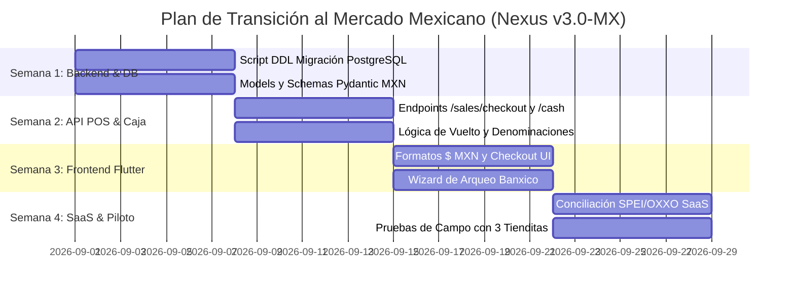

# DOCUMENTO MAESTRO DEL SISTEMA NEXUS v3.0
## Gestión Comercial Modular - Minorista México

> **Versión:** 3.0-MX  
> **Última actualización:** Septiembre 2026  
> **Estado:** Especificación Técnica Aprobada (SDD)  
> **Fundadores:** Alan y Eduardo  

---

## 📋 TABLA DE CONTENIDOS

1. [Introducción y Contexto](#1-introducción-y-contexto)
2. [Arquitectura Técnica](#2-arquitectura-técnica)
3. [Planes de Suscripción (SaaS)](#3-planes-de-suscripción-saas)
4. [Separación de Responsabilidades Financieras](#4-separación-de-responsabilidades-financieras)
5. [Módulos Funcionales](#5-módulos-funcionales)
6. [Sub-Requisitos UX y Setup sin Fricción](#6-sub-requisitos-ux-y-setup-sin-fricción)
7. [Esquema de Base de Datos y APIs](#7-esquema-de-base-de-datos-y-apis)
8. [Hosting e Infraestructura](#8-hosting-e-infraestructura)
9. [Seguridad y Roles](#9-seguridad-y-roles)
10. [Hoja de Ruta e Implementación Técnica](#10-hoja-de-ruta-e-implementación-técnica)
11. [Convenciones de Código](#11-convenciones-de-código)

---

## 1. INTRODUCCIÓN Y CONTEXTO

### 1.1 Misión y Principios
El sistema se rige en su totalidad por la misión y los principios fundamentales e inquebrantables detallados en el [Artículo I de la Constitución de Nexus](file:///d:/aland/Documents/Proyectos/Nexus/Constitucion%20Nexus%20v1-0.md#articulo-i-proposito-y-filosofia), incluyendo el **Principio 1.2.9: Cero Fricción en Setup e Inventario Orgánico**.

### 1.2 Mercado Objetivo y Alcance
* **Segmento:** Pequeños y medianos comercios minoristas en México (tienditas de abarrotes, misceláneas, minisuper, tiendas de conveniencia, papelerías y farmacias independientes).
* **Dispositivo principal:** Teléfonos celulares Android (gama baja/media) mediante aplicación móvil Flutter.
* **Dispositivo secundario:** PC/Tablet a través de Flutter Web.
* **Alcance Fiscal:** Emisión de notas de venta y comprobantes administrativos internos orientados al control operativo del comercio. **No se requiere timbrado de facturación electrónica CFDI 4.0 ante el SAT ni conexión con PACs en esta fase** (ver [Sección 8.2 de la Constitución](file:///d:/aland/Documents/Proyectos/Nexus/Constitucion%20Nexus%20v1-0.md#82-lo-que-el-sistema-no-debe-hacer-prohibiciones-inquebrantables)).

---

## 2. ARQUITECTURA TÉCNICA

### 2.1 Stack Tecnológico
El stack tecnológico y sus justificaciones cumplen con la ley de stack del [Artículo II (Sección 2.1) de la Constitución de Nexus](file:///d:/aland/Documents/Proyectos/Nexus/Constitucion%20Nexus%20v1-0.md#21-stack-tecnologico-obligatorio). 

Librerías y herramientas clave:
* **Búsqueda Fuzzy:** PostgreSQL utilizando la extensión `pg_trgm` para autocompletado rápido.
* **Caché Local Frontend:** `Hive` / `SharedPreferences` para almacenamiento persistente de solo lectura.
* **Escaneo de Código de Barras:** `mobile_scanner` en Flutter para captura ágil de códigos EAN/UPC con la cámara.
* **OCR On-Device (Costo $0):** `google_mlkit_text_recognition` para lectura de facturas físicas directamente en el smartphone sin llamadas a APIs cloud de pago.
* **Dictado de Voz Nativo:** Integración con Android SpeechRecognizer / Web Speech API en el cliente.

### 2.2 Arquitectura Multi-tenant
El aislamiento de inquilinos y la seguridad de datos se implementan mediante políticas RLS y contextos dinámicos detallados en el [Artículo II (Sección 2.2) de la Constitución](file:///d:/aland/Documents/Proyectos/Nexus/Constitucion%20Nexus%20v1-0.md#22-arquitectura-multi-tenant).

### 2.3 Conectividad, Sincronización y Escaneo
La lógica de red de solo lectura local y la interacción con códigos de barras se definen bajo las directrices del [Artículo II (Secciones 2.4 y 2.5) de la Constitución](file:///d:/aland/Documents/Proyectos/Nexus/Constitucion%20Nexus%20v1-0.md#24-conectividad-y-sincronizacion).

### 2.4 Motor de Catálogo de Dos Niveles (Two-Tier Engine)
* **Tier 1 (Catálogo Semilla EAN-13 GS1 México):** Base de datos precargada offline con ~1,000-2,000 productos líderes. Al escanear el código, autocompleta nombre y categoría en < 1 ms.
* **Tier 2 (Red Comunitaria con Consenso Automático):** Cuando un producto nuevo es registrado por $\ge 3$ comercios independientes con similitud > 80%, el sistema lo promueve automáticamente a la red global comunitaria, sin requerir curación manual de los fundadores.

---

## 3. PLANES DE SUSCRIPCIÓN (SAAS)

La estructura de precios en Pesos Mexicanos (MXN), cálculos de punto de equilibrio y la máquina de estados de suscripciones (`ACTIVE` $\rightarrow$ `SOFT_LOCK` $\rightarrow$ `HARD_LOCK`) se rigen por el [Artículo VI de la Constitución de Nexus](file:///d:/aland/Documents/Proyectos/Nexus/Constitucion%20Nexus%20v1-0.md#articulo-vi-modelo-comercial-saas).

| Plan | Tarifa Mensual | Usuarios | Almacenes | Módulos Principales |
|------|----------------|----------|-----------|---------------------|
| **Emprendedor** | **$199 MXN / mes** | Hasta 2 | 1 Almacén | Inventario, Ventas, Setup asistido, Alertas de stock |
| **Comercio** | **$399 MXN / mes** | Hasta 5 | Multi-almacén | Plan Base + Caja con cono Banxico, Catálogo WhatsApp, OCR facturas |
| **Corporativo** | **$699 MXN / mes** | Hasta 15 | Multi-almacén | Todos los módulos + Analítica avanzada y clonación multi-sucursal |

El acceso a los módulos y límites se valida dinámicamente en middleware mediante el `PlanID` asignado al `tenant_id`.

---

## 4. SEPARACIÓN DE RESPONSABILIDADES FINANCIERAS

El sistema opera bajo la estricta división entre cobros de SaaS y registro contable de ventas de comercios definida en el [Artículo III de la Constitución](file:///d:/aland/Documents/Proyectos/Nexus/Constitucion%20Nexus%20v1-0.md#articulo-iii-separacion-de-responsabilidades-financieras).

### 4.1 Panel de Administración Interno (Para Fundadores)
Interfaz exclusiva para Alan y Eduardo para la administración del SaaS en México:
* **Conciliación de Pagos:** Validación de transferencias SPEI (vía CLABE interbancaria dedicada / proveedor STP) y pagos en efectivo de OXXO Pay.
* **Notificaciones:** Activación automática del estado `ACTIVE` del tenant tras la confirmación del webhook y envío de confirmaciones transaccionales.
* **Métricas:** Dashboard administrativo con ingresos mensuales acumulados (MRR en $ MXN), total de tenants activos y retención.

---

## 5. MÓDULOS FUNCIONALES

### 5.1 Módulo de Inventario y Abastecimiento (Core)

| ID | Requisito | Descripción |
|----|-----------|-------------|
| **RF-01** | Importación con Mapeo Visual Flexible | Subida de cualquier archivo Excel/CSV con emparejamiento visual de columnas guiado (evita plantillas rígidas). |
| **RF-02** | Moneda Base Nativa MXN | Registro de costos (`cost_mxn`) y precios (`price_mxn`) en Pesos Mexicanos. Campo opcional `cost_usd_import` para mercancía importada. |
| **RF-03** | Combos y Promociones | Agrupación de productos con precio único en MXN. Al venderse, descuenta proporcionalmente el stock de cada artículo individual. |
| **RF-04** | Alertas de Stock Bajo | Notificaciones automáticas cuando un producto alcanza el umbral mínimo configurado (sin IA). |
| **RF-05** | Reportes de Inventario | Exportación a PDF/Excel del estado actual, filtrable por categoría, stock, almacén y proveedor. |
| **RF-06** | Gestión de Stock Reservado | El stock reservado en ventas no cobradas expira automáticamente en 15 minutos (cron job). |
| **RF-07** | Multi-almacén (Plan Comercio+) | Crear, gestionar y transferir stock entre almacenes y sucursales. |

### 5.2 Módulo de Ventas y Comisiones (Core)

| ID | Requisito | Descripción |
|----|-----------|-------------|
| **RF-08** | Notas de Venta y Comprobantes Internos | Emisión de notas de venta en formato ticket (58mm/80mm) y PDF/WhatsApp para control administrativo (sin timbrado CFDI 4.0). |
| **RF-09** | Inventario Orgánico Just-in-Time (POS) | Si se escanea un producto no existente durante la venta, el cajero digita solo nombre y precio; se cobra y se guarda silenciosamente para ventas futuras. |
| **RF-10** | Cálculo de Comisiones Dinámicas | Configuración de porcentajes por vendedor calculados sobre volumen de ventas o margen neto en MXN. |
| **RF-11** | Reportes de Ventas | Artículos más vendidos, rentabilidad y volumen en rangos de fechas específicos. |
| **RF-12** | Máquina de Estados de Venta | Transiciones estrictas: `DRAFT` $\rightarrow$ `PENDING_PAYMENT` (reserva stock) $\rightarrow$ `PAID` (descuenta stock) $\rightarrow$ `COMPLETED` / `CANCELLED` / `REFUNDED`. |
| **RF-13** | Registro Contable de Pagos en POS | Registro manual de métodos de pago en caja: Efectivo MXN, Transferencia SPEI, CoDi/Dimo y TPV (Clip, Mercado Pago Point, Zettle). **Sin validación automática de fondos**. |
| **RF-14** | Pagos Mixtos y Vuelto en MXN | División de una venta en múltiples métodos (ej. $200 Efectivo MXN + $150 SPEI). Calculadora de cambio con atajos para billetes mexicanos ($50, $100, $200, $500 MXN). |

### 5.3 Módulo de Compras y Proveedores (Core)

| ID | Requisito | Descripción |
|----|-----------|-------------|
| **RF-15** | Órdenes de Compra | Registro de solicitudes de reabastecimiento y entrada automática de mercancía al inventario al recibirse. |
| **RF-16** | Cuentas por Pagar a Proveedores | Seguimiento de saldos adeudados y créditos con proveedores nacionales en Pesos Mexicanos (MXN). |
| **RF-17** | Carga Manual de Facturas y Remisiones | Adjuntar PDF/JPG de facturas o notas de entrega para captura manual de compras (sin OCR cloud de pago). |

### 5.4 Módulo de Caja y Tesorería (Plan Comercio+)

| ID | Requisito | Descripción |
|----|-----------|-------------|
| **RF-18** | Arqueo con Cono Monetario Banxico | Registro de apertura, turnos y cierre de caja desglosando físicamente cada denominación oficial (Billetes $20-$1000, Monedas $0.50-$20). |
| **RF-19** | Asistente Visual de Cierre | Pantallas guiadas paso a paso (wizard) con ilustraciones de billetes y monedas de Banxico para agilizar el arqueo. |

### 5.5 Módulo de Analítica Avanzada (Plan Corporativo)

| ID | Requisito | Descripción |
|----|-----------|-------------|
| **RF-20** | Reportes de Rentabilidad Real | Gráficos de utilidad bruta y neta basados en costos históricos congelados al momento de cada venta. |
| **RF-21** | Dashboard Analítico en Tiempo Real | KPIs visuales comparativos (mes actual vs. anterior, año actual vs. anterior) para toma de decisiones. |
| **RF-22** | Gráficos Configurables | Catálogo de widgets métricos personalizables por el usuario. |

### 5.6 Módulo de Catálogo Digital WhatsApp (Plan Comercio+)

| ID | Requisito | Descripción |
|----|-----------|-------------|
| **RF-23** | Catálogo Digital Público | Enlace público sincronizado con el inventario del comercio (ej: `nexus.com/tienda/abarrotes-don-pepe`). |
| **RF-24** | Pedidos por WhatsApp | Selección de productos con generación automática de mensaje estructurado para envío directo al WhatsApp de la tienda. |
| **RF-25** | Sincronización Automática | Actualización inmediata de existencias y precios en $ MXN al modificarse en el inventario. |
| **RF-26** | SEO y Previews | Renderizado del lado del servidor (SSR) para previsualizaciones enriquecidas en WhatsApp. |
| **RF-27** | Botón de Compartir | Acceso rápido para compartir el catálogo en redes sociales y mensajería. |

### 5.7 Módulos de Setup Asistido y Red Comunitaria (Nuevos Requisitos Indispensables)

| ID | Requisito | Descripción |
|----|-----------|-------------|
| **RF-28** | Extracción OCR On-Device de Facturas | Captura de foto de factura física procesada localmente en el smartphone con Google ML Kit; extrae tabla de productos, cantidades y costos para poblar inventario inicial a costo $0. |
| **RF-29** | Catálogo Semilla Maestro EAN-13 + Red Comunitaria | Motor de autocompletado en dos niveles: Tier 1 (Base oficial offline con Top 1,000 abarrotes de México) y Tier 2 (Sugerencias verificadas por consenso automático de $\ge 3$ comercios independientes). |
| **RF-30** | Modo Escaneo Continuo de Góndola | Escáner en ráfaga permanente para dar de alta inventario físico en anaqueles con teclado numérico rápido para precio/stock. |
| **RF-31** | Clonación de Catálogo Base | Duplicación en 1 clic de la estructura de productos hacia nuevas sucursales o tiendas aliadas con stock inicial en 0. |

---

## 6. SUB-REQUISITOS UX Y SETUP SIN FRICCIÓN

| ID | Requisito | Descripción |
|----|-----------|-------------|
| **SR-01** | Onboarding Gamificado con Recompensas | Barra de progreso con hitos ("¡Tus primeros 50 artículos!") y beneficios tangibles por completar setup en la primera semana (1 mes gratis o desbloqueo temporal de módulos). |
| **SR-02** | Dashboard Mobile-Friendly en MXN | Centro de mando con "Action Cards" operativas y métricas financieras expuestas en `$ MXN`. |
| **SR-03** | Alternador de Vista Moneda (Opcional) | Toggle secundario de visibilidad (MXN/USD) deshabilitado por defecto, activable para comercios en la franja fronteriza norte. |
| **SR-04** | Checkout Ininterrumpido | Interfaz optimizada para escáner permanente y calculadora de cambio rápida con botones de billetes mexicanos ($50, $100, $200, $500 MXN). |
| **SR-05** | Tablero de Rendimiento de Empleados | Monitoreo en tiempo real de comisiones acumuladas por vendedor. |
| **SR-06** | Notificaciones Push Operativas | Alertas de stock crítico, vencimiento de suscripción y pedidos entrantes. |
| **SR-07** | Asistente Visual de Cierre de Caja | Wizard guiado con iconos interactivos de billetes y monedas del Banco de México para cuadres de turno. |
| **SR-08** | Formulario Minimalista de 3 Campos Vitales | Entrada manual ultra-rápida requiriendo únicamente **Nombre**, **Precio ($ MXN)** y **Cantidad inicial**, autogenerando el SKU (`NEX-XXXXX`). |
| **SR-09** | Captura por Dictado de Voz Nativo | Micrófono en pantalla para dictar productos ("Coca-Cola 600, precio 18, 24 piezas") procesado localmente con el motor de voz del smartphone. |

---

## 7. ESQUEMA DE BASE DE DATOS Y APIS

### 7.1 Script DDL de Migración a Pesos Mexicanos y Red Comunitaria (PostgreSQL)

```sql
-- 1. Adaptación de la Tabla de Productos a Pesos Mexicanos (MXN)
ALTER TABLE products 
  RENAME COLUMN price_usd TO price_mxn;
ALTER TABLE products 
  RENAME COLUMN cost_usd TO cost_mxn;
ALTER TABLE products 
  DROP COLUMN IF EXISTS price_ves_manual;
ALTER TABLE products 
  ADD COLUMN IF NOT EXISTS cost_usd_import NUMERIC(12, 4) DEFAULT NULL;

-- 2. Adaptación de la Tabla de Ventas y Métodos de Pago
ALTER TABLE sales 
  RENAME COLUMN exchange_rate_applied TO usd_mxn_exchange_rate_applied;
ALTER TABLE sales 
  ADD COLUMN IF NOT EXISTS payment_method_type VARCHAR(30) 
  CHECK (payment_method_type IN ('CASH_MXN', 'SPEI', 'CODI', 'CARD_TPV', 'MIXED'));

-- 3. Tabla de Denominaciones del Banco de México (Banxico) para Arqueo de Caja
CREATE TABLE IF NOT EXISTS cash_session_denominations (
    id UUID PRIMARY KEY DEFAULT gen_random_uuid(),
    cash_session_id UUID NOT NULL REFERENCES cash_sessions(id) ON DELETE CASCADE,
    tenant_id UUID NOT NULL REFERENCES tenants(id),
    bills_1000 INT DEFAULT 0,
    bills_500  INT DEFAULT 0,
    bills_200  INT DEFAULT 0,
    bills_100  INT DEFAULT 0,
    bills_50   INT DEFAULT 0,
    bills_20   INT DEFAULT 0,
    coins_20   INT DEFAULT 0,
    coins_10   INT DEFAULT 0,
    coins_5    INT DEFAULT 0,
    coins_2    INT DEFAULT 0,
    coins_1    INT DEFAULT 0,
    coins_050  INT DEFAULT 0,
    total_calculated_mxn NUMERIC(12,2) NOT NULL,
    created_at TIMESTAMP WITH TIME ZONE DEFAULT NOW()
);

CREATE INDEX IF NOT EXISTS idx_cash_denominations_tenant_session 
  ON cash_session_denominations(tenant_id, cash_session_id);

-- 4. Tablas para la Red Comunitaria Crowdsourced (Tier 2 con Consenso Automático)
CREATE TABLE IF NOT EXISTS community_catalog_submissions (
    barcode VARCHAR(50) NOT NULL,
    normalized_name VARCHAR(255) NOT NULL,
    category_name VARCHAR(100),
    tenant_hash_id VARCHAR(64) NOT NULL,
    created_at TIMESTAMP WITH TIME ZONE DEFAULT NOW(),
    PRIMARY KEY (barcode, tenant_hash_id)
);

CREATE TABLE IF NOT EXISTS community_verified_catalog (
    barcode VARCHAR(50) PRIMARY KEY,
    canonical_name VARCHAR(255) NOT NULL,
    category_name VARCHAR(100),
    confidence_score INT DEFAULT 3,
    updated_at TIMESTAMP WITH TIME ZONE DEFAULT NOW()
);

CREATE INDEX IF NOT EXISTS idx_community_verified_barcode ON community_verified_catalog(barcode);
```

### 7.2 Endpoints Core de API en FastAPI

#### `POST /api/v1/sales/checkout` — Checkout en Punto de Venta (MXN)
```json
{
  "client_id": "3fa85f64-5717-4562-b3fc-2c963f66afa6",
  "items": [
    {
      "product_id": "d1234567-89ab-cdef-0123-456789abcdef",
      "quantity": 2,
      "unit_price_mxn": 35.50
    },
    {
      "product_id": "e2345678-89ab-cdef-0123-456789abcdef",
      "quantity": 1,
      "unit_price_mxn": 18.00
    }
  ],
  "payments": [
    { "method": "CASH_MXN", "amount_paid": 100.00 },
    { "method": "SPEI", "amount_paid": 0.00, "reference_code": null }
  ],
  "total_mxn": 89.00,
  "change_given_mxn": 11.00
}
```

#### `POST /api/v1/cash/close-session` — Arqueo con Cono Banxico
```json
{
  "cash_session_id": "7b9e1022-3c4d-4e5f-a6b7-8c9d0e1f2a3b",
  "physical_counts": {
    "currency": "MXN",
    "bills": { "1000": 1, "500": 3, "200": 4, "100": 8, "50": 10, "20": 15 },
    "coins": { "20": 2, "10": 10, "5": 20, "2": 25, "1": 30, "0.50": 20 },
    "total_physical_cash": 4500.00
  },
  "digital_payments_summary": {
    "spei_total": 850.00,
    "tpv_card_total": 1200.00,
    "codi_total": 0.00
  }
}
```

---

## 8. HOSTING E INFRAESTRUCTURA

### 8.1 Presupuesto Mensual Inicial
* **Servidor Backend + PostgreSQL:** VPS económico (Contabo o Hetzner, 4GB RAM, ~$10 USD/mes / ~$200 MXN/mes).
* **Hosting Frontend Web:** Vercel o Cloudflare Pages (Free Tier, $0/mes).
* **Almacenamiento de Archivos:** Cloudflare R2 / Backblaze B2 (10GB gratis, $0/mes).
* **Emails Transaccionales:** Resend o Brevo (Free Tier, $0/mes).
* **Monitoreo:** UptimeRobot (Free Tier, $0/mes).
* **Costo mensual inicial total estimado:** **~$200 MXN / mes**.

### 8.2 Plan de Escalamiento por Fases (MXN)
| Fase | Clientes Activos | Ingreso Proyectado (MXN) | Acciones de Infraestructura |
|------|------------------|--------------------------|----------------------------|
| **Fase 1** | 0 - 3 | $0 - $600 MXN/mes | Hosting básico VPS ~$200 MXN/mes, backups manuales. Validación de MVP. |
| **Fase 2** | 4 - 15 | $800 - $6,000 MXN/mes | Automatización de backups en R2. Redundancia básica. |
| **Fase 3** | 16 - 50 | $6,000 - $25,000 MXN/mes | VPS de alto rendimiento. Soporte técnico dedicado. |
| **Fase 4** | 50+ | $25,000+ MXN/mes | Infraestructura distribuida de alta disponibilidad. |

### 8.3 Script de Backup Manual (Fase 1)
```bash
# 1. Volcado diario de la base de datos PostgreSQL
0 2 * * * pg_dump nexus | gzip > /backups/nexus_$(date +\%Y\%m\%d).sql.gz

# 2. Sincronización hacia almacenamiento Cloudflare R2 / Backblaze B2
0 3 * * * rclone copy /backups remote:r2-storage/backups/nexus
```

---

## 9. SEGURIDAD Y ROLES

### 9.1 Autenticación y Cifrado
* **Tokens:** JWT con Access Token (15 min) y Refresh Token (7 días).
* **Contraseñas:** Hashing con `bcrypt` o `argon2`. Sin texto plano.

### 9.2 Matriz de Permisos (RBAC Granular)
Permisos individuales por recurso (ej: `inventario.editar_precios`, `ventas.cobrar`, `caja.arquear`).

---

## 10. HOJA DE RUTA E IMPLEMENTACIÓN TÉCNICA

Plan de ejecución estructurado en **4 semanas**:


```mermaid
gantt
    title Plan de Transición al Mercado Mexicano (Nexus v3.0-MX)
    dateFormat  YYYY-MM-DD
    section Semana 1: Backend & DB
    Script DDL Migración PostgreSQL   :b1, 2026-09-01, 7d
    Models y Schemas Pydantic MXN     :b2, 2026-09-01, 7d
    section Semana 2: API POS & Caja
    Endpoints /sales/checkout y /cash :b3, 2026-09-08, 7d
    Lógica de Vuelto y Denominaciones :b4, 2026-09-08, 7d
    section Semana 3: Frontend Flutter
    Formatos $ MXN y Checkout UI      :b5, 2026-09-15, 7d
    Wizard de Arqueo Banxico          :b6, 2026-09-15, 7d
    section Semana 4: SaaS & Piloto
    Conciliación SPEI/OXXO SaaS       :b7, 2026-09-22, 7d
    Pruebas de Campo con 3 Tienditas  :b8, 2026-09-22, 7d
```

* **Semana 1: Base de Datos & Core Backend**
  * Ejecutar script de migración DDL en PostgreSQL (`cost_mxn`, `price_mxn`, `cash_session_denominations`, `community_verified_catalog`).
  * Actualizar Schemas Pydantic y Modelos SQLAlchemy a MXN.
  * Eliminar llamadas obligatorias a tasas de cambio en checkout estándar.
* **Semana 2: API FastAPI & Checkout POS**
  * Actualizar endpoints `/sales/checkout` y `/cash/close-session`.
  * Refactorizar cálculo de vuelto en MXN e integrar la tabla de denominaciones de Banxico y el motor de consenso comunitario.
* **Semana 3: Frontend Flutter Mobile/Web**
  * Actualizar interfaz en Flutter: formatos `$ MXN`, widgets de arqueo Banxico, Google ML Kit OCR local, modo escaneo de góndola y dictado por voz nativo.
* **Semana 4: Panel SaaS & Piloto México**
  * Integrar validación de transferencias SPEI y OXXO Pay para suscripciones.
  * Pruebas de campo con 3 tienditas de abarrotes piloto en México.

---

## 11. CONVENCIONES DE CÓDIGO

Todas las convenciones de bases de datos, APIs y nomenclatura se rigen bajo lo establecido en el [Artículo VIII de la Constitución de Nexus](file:///d:/aland/Documents/Proyectos/Nexus/Constitucion%20Nexus%20v1-0.md#articulo-viii-convenciones-de-codigo-y-prohibiciones).
