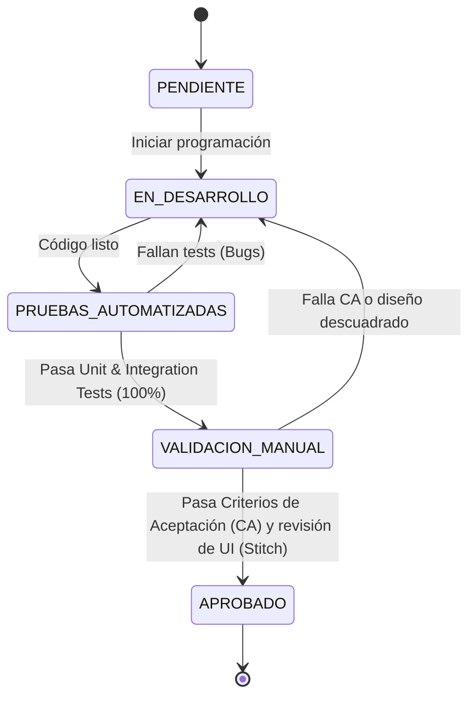

# Plan de Acción y Lista de Tareas: Nexus v3.0

Este documento establece el plan de desarrollo, los criterios de aceptación detallados por requerimiento, la arquitectura de pruebas unitarias/integración, el ciclo de validación estricto, y la guía de integración con el servidor MCP de **Google Stitch** para la construcción de interfaces.

---

## 🔁 1. Ciclo de Validación Estricto (Flujo de Trabajo)

Para asegurar la calidad y consistencia ACID exigida por la Constitución (Art. I, Principio 2), ningún requerimiento o módulo de negocio puede ser considerado **APROBADO** o **COMPLETO** sin superar el siguiente ciclo de validación:

### Reglas de Transición
1. **Paso a Pruebas Automatizadas:** El código del backend y frontend debe compilar sin advertencias y tener implementadas sus respectivas suites de prueba.
2. **Paso a Validación Manual:** La cobertura de pruebas automatizadas en lógica de negocio crítica (comisiones, stock, arqueo, RLS) debe ser de **mínimo 80%**.
3. **Paso a Aprobado:** Requiere la firma/aprobación de los fundadores (Alan y Eduardo) validando que se cumplen el 100% de los Criterios de Aceptación (CA) y que el diseño coincide con los bocetos de Google Stitch.

---

## 🧪 2. Arquitectura de Pruebas Obligatoria

### Backend (Python + FastAPI)
- **Framework:** `pytest` con `pytest-asyncio` para pruebas asíncronas.
- **Base de Datos de Pruebas:** Se utilizará una base de datos PostgreSQL de prueba aislada (limpiada en cada `fixture`).
- **Pruebas Unitarias:** Lógica de redondeo bimoneda, expiración de TTL de stock reservado y cálculo de comisiones.
- **Pruebas de Integración:**
  - Validación del middleware de morosidad (simulación de respuesta 403 en Soft/Hard Lock).
  - **Prueba de Aislamiento RLS:** Autenticar dos clientes diferentes y validar que el Tenant A no puede leer ni modificar ningún registro del Tenant B (retornando conjunto vacío o error).

### Frontend (Flutter + Riverpod)
- **Framework:** `flutter_test` y `integration_test`.
- **Pruebas Unitarias/Widget:**
  - Cambio de moneda global (Toggle USD/VES) en cabecera y traducción de valores usando la tasa del día.
  - Comportamiento del formulario de login y almacenamiento en Hive.
- **Pruebas de Integración:** Mockear el cliente HTTP `Dio` para simular respuestas del backend, validando la redirección al Login tras un error de expiración de token o un Hard Lock.

---

## 🎨 3. Guía de Integración con Google Stitch (MCP)

El servidor MCP de **Google Stitch** (`@_davideast/stitch-mcp`) expone bocetos, esquemas visuales y componentes UI listos para codificar. 

### Configuración del Servidor
El archivo de configuración de tu IDE `C:\Users\aland\.gemini\antigravity-ide\mcp_config.json` declara:
- **Server Name:** `stitch`
- **Command:** `npx -y @_davideast/stitch-mcp proxy`
- **Autenticación:** Inyectada mediante `STITCH_API_KEY`.

### Workflow con Stitch MCP para el Frontend:
Cuando el IDE o el agente tenga activo el servidor `stitch`, utilizaremos las siguientes herramientas de MCP para construir las pantallas de Flutter:
1. **`get_screen_image`:** Descargar el mockup visual de una pantalla (ej. Checkout, Cierre de Caja, Onboarding) para mapear espaciados, colores y tipografía HSL.
2. **`get_screen_code`:** Obtener la estructura HTML/CSS sugerida por Stitch para traducirla de forma exacta a widgets de Flutter.
3. **`build_site` / `doctor`:** Validar que la compilación visual local y la salud de la conexión de diseño estén alineadas con el Figma/Stitch Canvas original.

> [!TIP]
> En cada tarea de frontend detallada abajo, indicamos qué herramienta de Stitch MCP consultar para obtener el diseño de referencia.

---

## 📋 4. Lista de Tareas y Criterios de Aceptación (Roadmap)

### Módulo 1: Inventario y Abastecimiento (Core)

#### [x] Tarea 1.1: Carga Inicial Masiva (RF-01)
- **Descripción:** Desarrollar un script o endpoint en el backend para normalizar e insertar datos desde Excel.
- **Criterios de Aceptación:**
  - El sistema debe aceptar un archivo `.xlsx` o `.csv` con columnas: nombre, código de barras (opcional), costo_usd, precio_usd, stock_inicial.
  - El backend debe validar que no existan códigos de barra duplicados dentro del mismo tenant.
  - Se debe registrar automáticamente un movimiento de inventario del tipo `ENTRADA` por cada producto cargado.
- **Pruebas Requeridas:**
  - *Integración (Backend):* Enviar un archivo Excel de prueba mediante POST y verificar que los productos se inserten correctamente y se filtre el tenant apropiado.

#### [x] Tarea 1.2: Manejo Bimoneda Nativo en Inventario (RF-02)
- **Descripción:** Registro de costos/precios en USD y cálculo en VES en tiempo real.
- **Criterios de Aceptación:**
  - Cada producto almacena `cost_usd`, `price_usd` y `price_ves_manual` (opcional).
  - Al consultar el inventario, si `price_ves_manual` es nulo, el sistema calcula automáticamente `price_usd * tasa_del_dia`.
- **Pruebas Requeridas:**
  - *Unitaria (Backend):* Validar la función de cálculo de precios con tasas decimales flotantes.

#### [x] Tarea 1.3: Combos y Promociones (RF-03)
- **Descripción:** Agrupación de productos con precio único y descuento proporcional de stock.
- **Criterios de Aceptación:**
  - Al vender un Combo, el sistema debe verificar que haya stock disponible de todos los componentes individuales en el almacén especificado.
  - Al confirmarse la venta, se descuenta la cantidad correspondiente del inventario de cada artículo individual.
- **Pruebas Requeridas:**
  - *Unitaria (Backend):* Intentar vender un combo donde un artículo no tiene suficiente stock; debe fallar con excepción `INSUFFICIENT_STOCK`.

#### [x] Tarea 1.4: Stock Reservado con TTL (RF-06)
- **Descripción:** Liberar automáticamente el stock reservado en compras no cobradas tras 15 minutos.
- **Criterios de Aceptación:**
  - Las ventas en estado `PENDING_PAYMENT` mueven las cantidades de `stock_available` a `stock_reserved`.
  - Un cron job/worker debe ejecutarse cada minuto y anular las ventas en este estado cuya fecha de creación supere los 15 minutos, devolviendo las cantidades a `stock_available`.
- **Pruebas Requeridas:**
  - *Unitaria (Backend):* Simular una venta creada hace 16 minutos y verificar que el script de limpieza libere el stock correctamente.

---

### Módulo 2: Ventas y Comisiones (Core)

#### [ ] Tarea 2.1: Máquina de Estados de Venta (RF-12)
- **Descripción:** Control rígido de transiciones de ventas.
- **Criterios de Aceptación:**
  - Los estados permitidos son: `DRAFT` $\rightarrow$ `PENDING_PAYMENT` $\rightarrow$ `PAID` $\rightarrow$ `COMPLETED`.
  - Se permiten las transiciones a `CANCELLED` desde `DRAFT` o `PENDING_PAYMENT`.
  - Se permite `REFUNDED` únicamente después de `PAID` o `COMPLETED`.
- **Pruebas Requeridas:**
  - *Unitaria (Backend):* Testear transiciones inválidas (ej. de `DRAFT` directo a `COMPLETED`) y asegurar que lancen `ValidationError`.

#### [ ] Tarea 2.2: Checkout Rápido e Interfaz Móvil (SR-04 & RF-14)
- **Descripción:** Pantalla de ventas en el frontend con escáner e ingreso de pagos mixtos.
- **Criterios de Aceptación:**
  - La interfaz de checkout debe permitir leer códigos de barras de forma continua usando la cámara trasera (dependencia `mobile_scanner`).
  - Al presionar cobrar, debe permitir ingresar múltiples métodos de pago (ej: $10 USD en efectivo y Bs. 200 en Pago Móvil) y calcular el vuelto exacto en la moneda seleccionada.
- **Diseño de Referencia:** Consultar Stitch MCP (`get_screen_image` con ID de pantalla `checkout_flow`).

#### [ ] Tarea 2.3: Registro de Productos al Vuelo (RF-09 / RF-21)
- **Descripción:** Modal rápido para crear productos durante la venta sin cancelar la operación.
- **Criterios de Aceptación:**
  - Si un producto escaneado no existe, debe desplegarse un modal no bloqueante.
  - Campos mínimos: Nombre, precio_usd y stock_inicial.
  - Al guardar, el producto se agrega a la base de datos en background y se inserta automáticamente al carrito del cajero en curso.
- **Diseño de Referencia:** Consultar Stitch MCP (`get_screen_image` con ID de pantalla `quick_product_creation`).

#### [ ] Tarea 2.4: Cálculo de Comisiones Dinámicas (RF-10)
- **Descripción:** Lógica contable para la retribución de vendedores.
- **Criterios de Aceptación:**
  - Permite configurar porcentajes de comisión por vendedor.
  - La comisión se calcula al pasar la venta al estado `PAID`.
- **Pruebas Requeridas:**
  - *Unitaria (Backend):* Verificar el cálculo decimal de comisiones basándose en el margen de ganancia real (precio de venta - costo de compra congelado).

---

### Módulo 3: Caja y Tesorería (Plan Comercio+)

#### [ ] Tarea 3.1: Arqueo Multimoneda y Wizard de Cierre (RF-18 & RF-19)
- **Descripción:** Flujo guiado de apertura y cierre de caja contando denominaciones.
- **Criterios de Aceptación:**
  - Al cerrar caja, el sistema solicita al usuario el conteo físico detallado por billete (USD y VES).
  - El sistema calcula el balance teórico esperado (`expected_balance_usd/ves`) sumando el saldo inicial y las ventas registradas.
  - Compara el saldo físico real contra el esperado y registra faltantes/sobrantes.
- **Diseño de Referencia:** Consultar Stitch MCP (`get_screen_image` con ID de pantalla `cash_register_wizard`).
- **Pruebas Requeridas:**
  - *Integración (Backend):* Crear una sesión de caja, registrar 3 ventas con métodos de pago mixtos, cerrar la caja con valores físicos y validar que el arqueo registre la discrepancia correcta.

---

### Módulo 4: Catálogo Digital WhatsApp (Plan Comercio+)

#### [ ] Tarea 4.1: Catálogo Digital Público y Pedidos (RF-23 & RF-24)
- **Descripción:** Enlace web público que genera un mensaje estructurado para WhatsApp.
- **Criterios de Aceptación:**
  - Generar ruta pública `/tienda/{slug_comercio}` renderizada con SSR para previsualizaciones rápidas de enlace.
  - Permite agregar productos a un carrito público.
  - Al presionar "Enviar Pedido", abre WhatsApp con un mensaje pre-formateado detallando productos, cantidades y total a pagar.
- **Diseño de Referencia:** Consultar Stitch MCP (`get_screen_code` con ID de pantalla `whatsapp_catalog`).

---

### Módulo 5: Administración SaaS (Fundadores)

#### [ ] Tarea 5.1: Panel de Aprobaciones de Pago (RF-04 de SDD)
- **Descripción:** Interfaz exclusiva para Alan y Eduardo para la aprobación manual de suscripciones de comercios.
- **Criterios de Aceptación:**
  - Pantalla para listar pagos de inquilinos en estado `PENDIENTE`.
  - Muestra la captura de pantalla de transferencia adjunta.
  - Al presionar `Aprobar`, cambia la factura a `PAGADA`, el estado del tenant a `ACTIVE` y envía correo de confirmación.
- **Diseño de Referencia:** Consultar Stitch MCP (`get_screen_image` con ID de pantalla `saas_admin_dashboard`).
